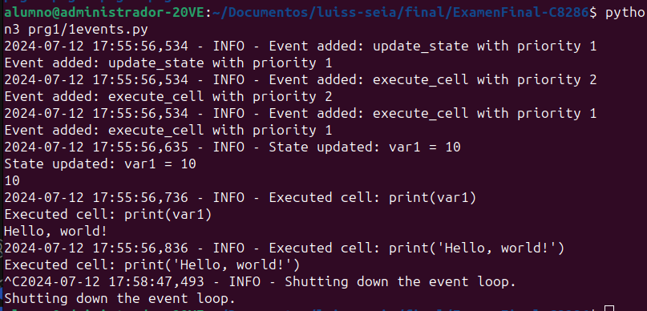
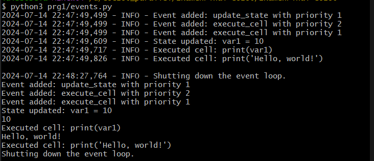

# Pregunta 1 (5 puntos): Implementa un sistema basado en eventos en Python 
que simule cómo los Jupyter Notebooks manejan eventos e interacciones de usuario. Esto incluye crear un bucle de  eventos, manejar diferentes tipos de eventos y actualizar el estado de un notebook simulado basado en interacciones de usuario.

## El código debe incluir:
• Usar asyncio para manejar la ejecución asíncrona de celdas y el manejo de eventos.
• Implementar mecanismos de manejo de errores y registro de logs para diferentes tipos de
errores.
• Asegurae operaciones seguras en los hilos al acceder a recursos compartidos.
• Implementa un sistema para filtrar y priorizar eventos según su importancia o tipo

## Explicacio de la implementacion
**Configuración del Registro de Logs:** Utilizamos la biblioteca logging para registrar información, advertencias y errores.

**Clase Event:** Define un evento con prioridad, tipo y datos. La prioridad permite ordenar los eventos en la cola de prioridad.

**Clase Notebook:** Simula un notebook con celdas, una cola de eventos y un estado. Utiliza un PriorityQueue para manejar los eventos y un threading.Lock para asegurar operaciones seguras en los hilos.

**Métodos de Notebook:**

    add_cell: Agrega una celda al notebook.
    update_state: Actualiza el estado del notebook.
    execute_cell: Ejecuta el código de una celda de forma asíncrona.
    handle_event: Maneja los diferentes tipos de eventos.
    event_loop: Bucle de eventos que procesa los eventos de la cola de prioridad.

**Función user_interactions:** Simula interacciones del usuario añadiendo eventos al notebook.

**Función main:** Inicia el notebook y las interacciones del usuario utilizando asyncio.gather para ejecutar ambas de forma concurrente.

## Interpretacion

aqui notamos lo que se ha simulado la ejecucion de la celdas y asi sucesivamente

## Cambios realizados

### output 

En la imagen muestra cómo el sistema ha agregado y procesado eventos correctamente, ejecutando celdas de código en orden de prioridad y actualizando el estado compartido. Todos los eventos se registraron adecuadamente y el sistema se cerró con el atajo de teclado `ctrl + C` sin errores.

### Mejoras y Correcciones
**Documentación**: Se añadieron comentarios detallados para explicar la funcionalidad de cada clase y método.
**Output Consola:** Se mejoraron los mensajes de salida a la consola para dar retroalimentación al usuario.
**Prioridad y Manejo de Eventos:** Se verificó el manejo adecuado de eventos según su prioridad.

**Creacion de un nuevo archivo**: Además se ha creado un nuevo archivo llamado `events-mejorado.py`
