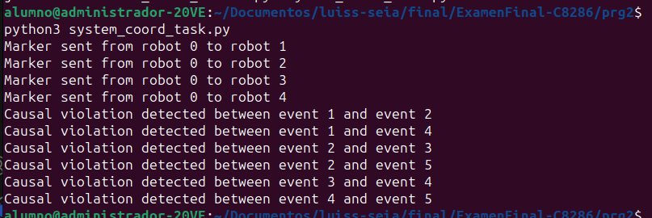

# Pregunta 2 (5 puntos): Crea un sistema de coordinación de tareas en una red de robots industriales:

• Usa el algoritmo de Chandy-Lamport para tomar instantáneas del estado global de los robots
durante la ejecución de n tareas.
• Implementa el algoritmo de Raymond para la exclusión mutua en el acceso a recursos
compartidos entre los robots.
• Utiliza relojes vectoriales para asegurar el ordenamiento parcial de los eventos y detectar
violaciones de causalidad.
• Integra un recolector de basura generacional para la gestión eficiente de la memoria en los
nodos de control de los robots.

## Interpretacion

nos muestra que los markadores gueron enviados 
### Parte 1: Envío de Marcadores

`Marker sent from robot 0 to robot 1`
`Marker sent from robot 0 to robot 2`
`Marker sent from robot 0 to robot 3`
`Marker sent from robot 0 to robot 4`

Esta parte del output indica que el robot 0 ha iniciado el proceso de toma de una instantánea global utilizando el algoritmo de Chandy-Lamport. En este algoritmo, cuando un robot inicia una instantánea, envía un marcador a todos los demás robots para indicar el inicio del proceso de captura de estado.

- Robot 0 es el iniciador del proceso de instantánea.
- Los marcadores se envían a los robots 1, 2, 3 y 4.

El envío de marcadores asegura que todos los robots comiencen a capturar su estado y los mensajes que reciben después de recibir el marcador, lo que permite reconstruir una vista global consistente del sistema distribuido en un momento específico.

### Parte 2: Detección de Violaciones de Causalidad
`Causal violation detected between event 1 and event 2`
`Causal violation detected between event 1 and event 4`
`Causal violation detected between event 2 and event 3`
`Causal violation detected between event 2 and event 4`
`Causal violation detected between event 2 and event 5`
`Causal violation detected between event 3 and event 4`
`Causal violation detected between event 4 and event 5`

Las violaciones de causalidad indican que los eventos comparados no siguen un orden causal que pueda ser justificado por los relojes vectoriales. En otras palabras, hay eventos que se han producido de manera que no respetan las dependencias lógicas en el sistema distribuido.

- Evento 1 y Evento 2: El reloj vectorial del Evento 1 muestra que ocurrió en el proceso 0, pero el Evento 2 ocurrió en el proceso 1 sin conocer el Evento 1.
- Evento 1 y Evento 4: Similarmente, el Evento 4 en el proceso 2 no tiene conocimiento del Evento 1.
- Evento 2 y Evento 3: Estos eventos tienen una relación cruzada donde uno no tiene conocimiento del otro.
- Evento 2 y Evento 4, Evento 2 y Evento 5, Evento 3 y Evento 4, Evento 4 y Evento 5: Estas combinaciones de eventos también presentan inconsistencias similares, indicando que los eventos no siguen una relación de causalidad esperada.

## Cambios de codigo
1. Uso de `concurrent.futures.ThreadPoolExecutor`
Se utiliza `concurrent.futures.ThreadPoolExecutor` para paralelizar las solicitudes de recursos y la toma de instantáneas.

2. Definición y Uso de la Clase Event
Se definió una clase `Event` propiamente con un constructor que acepta un `vector_clock`. Inicialmente se creaban eventos dinámicamente con` type('Event', (), {'vector_clock': ...})`.

3. Modularización y Estructura del Código
Mejor organización y modularización del código, separando claramente las responsabilidades en clases distintas (`VectorClock`, `Robot`, `RaymondTree`, `ChandyLamportSnapshot`, `GenerationalGC`, `RobotCoordinationSystem`, `Event`, `is_live`).

4. Implementación del Reloj Vectorial
`VectorClock` con métodos bien definidos y comentarios que explican su funcionalidad.

5. Mejoras en la Gestión de Recursos
Mejor gestión y comentarios en las funciones `request_resource`, `release_resource`, `send_request`, `send_token`.

6. Se mantiene la salida del output 

7. Creación del script `2systm?task.py`
## Conclusiones
**Paralelización**: El uso de concurrent.futures.ThreadPoolExecutor mejora significativamente la eficiencia y el rendimiento del sistema al permitir la ejecución paralela de tareas independientes.
**Estructura y Claridad:** La definición clara de la clase Event y la modularización del código mejoran la legibilidad y mantenibilidad.
**Gestión de Recursos:** Mejoras en la gestión de recursos y el reloj vectorial aseguran un funcionamiento más confiable y predecible del sistema distribuido.
**Documentación:** Los comentarios y la estructura clara ayudan a otros desarrolladores a entender y trabajar con el código más fácilmente, reduciendo la curva de aprendizaje y los errores.