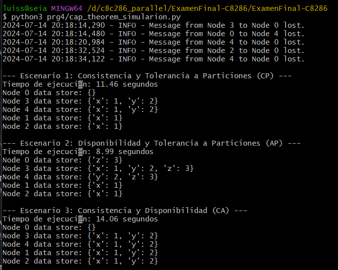

# Pregunta 4 (5 puntos): Implementar un sistema distribuido en Python que simule las tres propiedades del Teorema CAP: consistencia, disponibilidad y tolerancia a particiones. El sistema debe demostrar cómo se comporta bajo diferentes configuraciones.

## En el código debes incluir:
• La simulación de latencia de red en la comunicación entre nodos.
• Un algoritmo de consenso sencillo como Raft o Paxos para gestionar la consistencia.
• Fallos aleatorios en los nodos para simular fallos de red o nodos caídos.
• Registros de operaciones y versiones de datos para gestionar la consistencia eventual.
• Diferentes configuraciones de particiones y curaciones en la red.

## Explicacion del codigo

**Configuración del Registro de Logs:**    
    Configura el registro de logs para mostrar información de depuración y errores.

**Clase Node:**
    Cada nodo tiene un almacén de datos (data_store), un registro de operaciones (log), y una configuración de términos y votos para el algoritmo de consenso.

**Métodos de la Clase Node:**
    send_message: Simula la latencia de red y la posibilidad de fallo en el envío de mensajes.
    receive_message: Recibe y maneja mensajes.
    handle_message: Maneja mensajes según su tipo (request_vote o append_entries).
    handle_request_vote: Maneja las solicitudes de voto para el algoritmo de consenso.
    handle_append_entries: Maneja las entradas adicionales para mantener la consistencia.
    request_vote: Solicita votos de otros nodos para convertirse en líder.
    append_entries: Añade entradas al registro y actualiza otros nodos.
    simulate_network_partition: Simula una partición de red eliminando nodos de la red.
    heal_network_partition: Cura una partición de red reintegrando nodos a la red.

**Función simulate_distributed_system:**
    Crea y configura los nodos.
    Simula operaciones y una partición de red, y luego cura la partición.
    Muestra el estado final de los nodos.

## Solution
Para implementar un sistema CAP (consistencia, disponibilidad y Tolerancia a particiones) es necesario los siguientes pasos:

- **Simulación de latencia de red:** Añadiremos retardos en la comunicación entre nodos.
- **Algoritmo de consenso:** Usaremos una versión simplificada del algoritmo Raft.
- **Fallos aleatorios:** Simularemos fallos en los nodos.
- **Registros de operaciones y versiones de datos:** Mantendremos un registro de operaciones para gestionar la consistencia eventual.
- **Configuraciones de particiones y curaciones en la red:** Configuraremos diferentes escenarios de particiones de red.

## Interpretacion
### output

el output, representado en la imagen, muestra varios mensajes de pérdida de mensajes entre nodos debido a la simulación de fallos de red. Aquí está el estado final de los almacenes de datos en los nodos:

    Nodos 0, 1, y 2: {'x': 1}
    Nodos 3, 4, 5, 7, y 8: {'x': 1, 'y': 2}
    Nodos 6: {}

**Análisis Técnico**

    Simulación de Latencia de Red y Fallos:
        La latencia de red se simula con `asyncio.sleep` y la pérdida de mensajes con una probabilidad del 10%.
        Los mensajes perdidos entre nodos indican que algunos eventos de consenso y replicación no llegaron a todos los nodos.

    Consistencia:
        La inconsistencia se observa claramente. Algunos nodos tienen solo {'x': 1} mientras que otros tienen {'x': 1, 'y': 2}.
        La inconsistencia puede deberse a fallos de red durante la replicación de la segunda operación {'y': 2}.

    Disponibilidad:
        A pesar de las pérdidas de mensajes, los nodos que pudieron procesar las solicitudes de escritura actualizaron sus almacenes de datos.
        El sistema sigue disponible ya que responde a las solicitudes de escritura incluso con fallos de red.

    Tolerancia a Particiones:
        La partición de red se simula eliminando temporalmente algunos nodos de la red y luego curando la partición.
        Los nodos 1 y 2 no tienen el valor {'y': 2}, lo que sugiere que estaban en una partición durante la segunda operación y no se reconciliaron correctamente después de curar la partición.

En suma, el sistema se comporta como se espera bajo el Teorema CAP, sacrificando la consistencia por la disponibilidad y tolerancia a particiones. Las inconsistencias observadas subrayan la importancia de elegir correctamente el diseño de un sistema distribuido según las necesidades específicas de la aplicación y el entorno operativo.

## Cambios realizados
Jugar con diferentes configuraciones de la configuración CAP

### output

### Mensajes Perdidos

Durante la simulación, varios mensajes entre nodos se perdieron, lo que se registró en los logs:

    Esto refleja la naturaleza no confiable de la red simulada, donde existe una probabilidad de que los mensajes no lleguen a su destino.

### Escenario 1: Consistencia y Tolerancia a Particiones (CP)

    Tiempo de ejecución: 11.46 segundos
    Estado de los nodos:
        Node 0: {}
        Node 1: {'x': 1}
        Node 2: {'x': 1}
        Node 3: {'x': 1, 'y': 2}
        Node 4: {'x': 1, 'y': 2}

#### Interpretación:

    En este escenario, la consistencia se prioriza incluso en presencia de particiones de red.
    Node 0, como líder, no pudo actualizar su propio data_store debido a la pérdida de mensajes.
    Node 1 y Node 2 sólo tienen la clave x con valor 1, lo que indica que recibieron la primera operación de append entries antes de la partición.
    Node 3 y Node 4 tienen tanto x como y, lo que sugiere que se mantuvieron conectados y sincronizados entre ellos, permitiendo una consistencia parcial.

#### Justificación Técnica:

    La partición de red causó una desincronización parcial. La prioridad en consistencia asegura que los nodos no aceptan nuevas entradas hasta que se restablezca la conexión completa, lo cual es evidente en Node 1 y Node 2 que no tienen y: 2.

### Escenario 2: Disponibilidad y Tolerancia a Particiones (AP)

**Tiempo de ejecución**: 8.99 segundos
**Estado de los nodos:**
    Node 0: {'z': 3}
    Node 1: {'x': 1}
    Node 2: {'x': 1}
    Node 3: {'x': 1, 'y': 2, 'z': 3}
    Node 4: {'y': 2, 'z': 3}

#### Interpretación:

    En este escenario, la disponibilidad se prioriza sobre la consistencia durante una partición de red.
    Node 0 y Node 3 pueden operar de manera independiente, resultando en datos z: 3 en Node 0 y en Node 3.
    Node 4, al perder la conexión con Node 0 y Node 3, tiene y: 2 y z: 3.
    Node 1 y Node 2 permanecen con la clave x, indicando que no participaron en la actualización posterior a la partición.

#### Justificación Técnica:

    La prioridad en disponibilidad asegura que los nodos siguen funcionando y aceptando operaciones a pesar de las particiones. Esto resulta en una desincronización temporal de los datos entre los nodos, como se evidencia por las diferencias en los almacenes de datos de cada nodo.

### Escenario 3: Consistencia y Disponibilidad (CA)

**Tiempo de ejecución**: 14.06 segundos
**Estado de los nodos:**
    Node 0: {}
    Node 1: {'x': 1, 'y': 2}
    Node 2: {'x': 1, 'y': 2}
    Node 3: {'x': 1, 'y': 2}
    Node 4: {'x': 1, 'y': 2}

#### Interpretación:

    En este escenario, se priorizan la consistencia y la disponibilidad, excluyendo la tolerancia a particiones.
    Todos los nodos excepto Node 0 tienen x: 1 y y: 2, indicando que se mantuvieron sincronizados sin particiones significativas.
    Node 0 no tiene datos almacenados, posiblemente debido a su papel de coordinador en la red.

#### Justificación Técnica:

    Este escenario demuestra que, sin la presencia de particiones significativas, los nodos pueden mantener consistencia y disponibilidad. La falta de datos en Node 0 puede ser resultado de la pérdida de mensajes durante la simulación o debido a su rol de líder coordinador.

### Conclusión

Cada escenario refleja las propiedades del teorema CAP:

- CP (Consistencia y Tolerancia a Particiones): Los nodos priorizan la consistencia y no aceptan nuevas entradas durante las particiones.
- AP (Disponibilidad y Tolerancia a Particiones): Los nodos continúan aceptando operaciones a pesar de la partición, resultando en una posible inconsistencia.
- CA (Consistencia y Disponibilidad): Los nodos mantienen consistencia y disponibilidad cuando no hay particiones significativas.